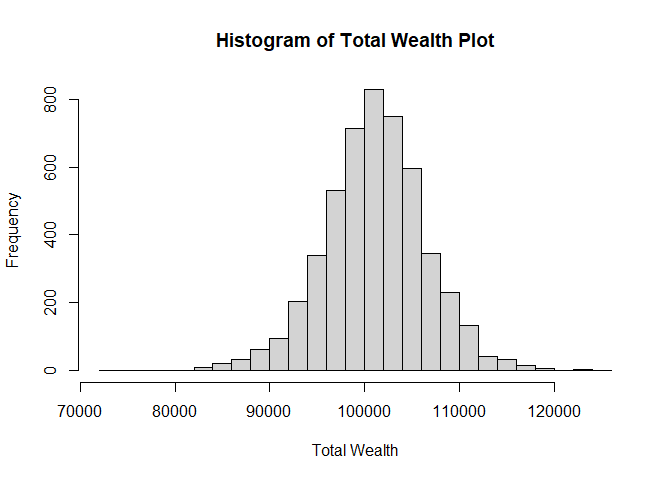
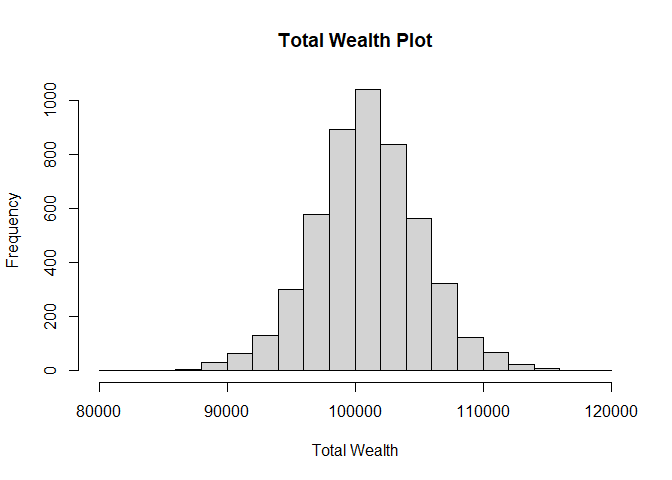
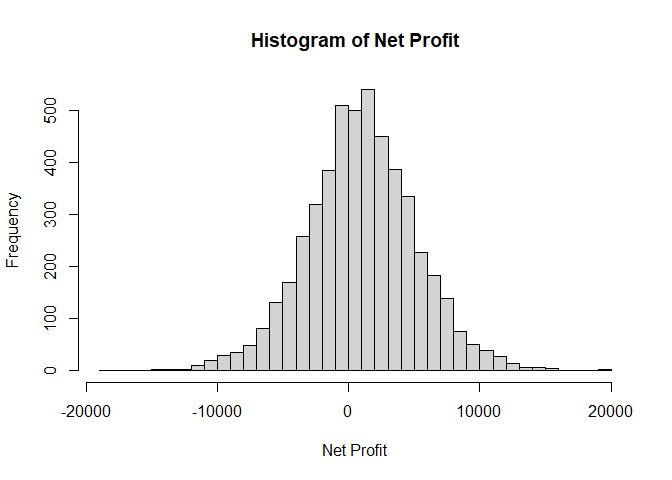
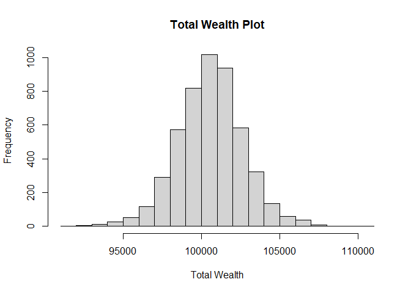
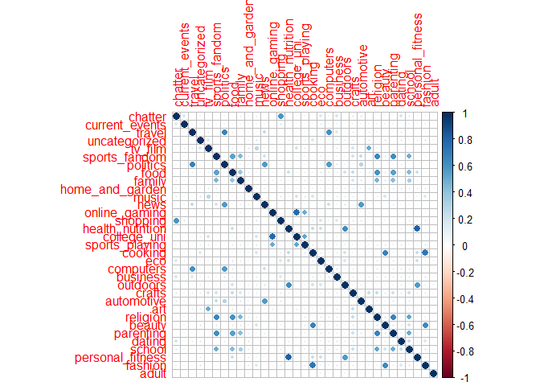

## Github link for this project: <https://github.com/BashfulBaobab/ML-Project-Repo>

## R Markdown

STA380 Part II

# Question 1 - Green Buildings

    ##  CS_PropertyID        cluster            size            empl_gr       
    ##  Min.   :      1   Min.   :   1.0   Min.   :   1624   Min.   :-24.950  
    ##  1st Qu.: 157452   1st Qu.: 272.0   1st Qu.:  50891   1st Qu.:  1.740  
    ##  Median : 313253   Median : 476.0   Median : 128838   Median :  1.970  
    ##  Mean   : 453003   Mean   : 588.6   Mean   : 234638   Mean   :  3.207  
    ##  3rd Qu.: 441188   3rd Qu.:1044.0   3rd Qu.: 294212   3rd Qu.:  2.380  
    ##  Max.   :6208103   Max.   :1230.0   Max.   :3781045   Max.   : 67.780  
    ##                                                       NA's   :74       
    ##       Rent         leasing_rate       stories            age        
    ##  Min.   :  2.98   Min.   :  0.00   Min.   :  1.00   Min.   :  0.00  
    ##  1st Qu.: 19.50   1st Qu.: 77.85   1st Qu.:  4.00   1st Qu.: 23.00  
    ##  Median : 25.16   Median : 89.53   Median : 10.00   Median : 34.00  
    ##  Mean   : 28.42   Mean   : 82.61   Mean   : 13.58   Mean   : 47.24  
    ##  3rd Qu.: 34.18   3rd Qu.: 96.44   3rd Qu.: 19.00   3rd Qu.: 79.00  
    ##  Max.   :250.00   Max.   :100.00   Max.   :110.00   Max.   :187.00  
    ##                                                                     
    ##    renovated         class_a          class_b            LEED         
    ##  Min.   :0.0000   Min.   :0.0000   Min.   :0.0000   Min.   :0.000000  
    ##  1st Qu.:0.0000   1st Qu.:0.0000   1st Qu.:0.0000   1st Qu.:0.000000  
    ##  Median :0.0000   Median :0.0000   Median :0.0000   Median :0.000000  
    ##  Mean   :0.3795   Mean   :0.3999   Mean   :0.4595   Mean   :0.006841  
    ##  3rd Qu.:1.0000   3rd Qu.:1.0000   3rd Qu.:1.0000   3rd Qu.:0.000000  
    ##  Max.   :1.0000   Max.   :1.0000   Max.   :1.0000   Max.   :1.000000  
    ##                                                                       
    ##    Energystar       green_rating          net            amenities     
    ##  Min.   :0.00000   Min.   :0.00000   Min.   :0.00000   Min.   :0.0000  
    ##  1st Qu.:0.00000   1st Qu.:0.00000   1st Qu.:0.00000   1st Qu.:0.0000  
    ##  Median :0.00000   Median :0.00000   Median :0.00000   Median :1.0000  
    ##  Mean   :0.08082   Mean   :0.08677   Mean   :0.03471   Mean   :0.5266  
    ##  3rd Qu.:0.00000   3rd Qu.:0.00000   3rd Qu.:0.00000   3rd Qu.:1.0000  
    ##  Max.   :1.00000   Max.   :1.00000   Max.   :1.00000   Max.   :1.0000  
    ##                                                                        
    ##   cd_total_07     hd_total07    total_dd_07   Precipitation  
    ##  Min.   :  39   Min.   :   0   Min.   :2103   Min.   :10.46  
    ##  1st Qu.: 684   1st Qu.:1419   1st Qu.:2869   1st Qu.:22.71  
    ##  Median : 966   Median :2739   Median :4979   Median :23.16  
    ##  Mean   :1229   Mean   :3432   Mean   :4661   Mean   :31.08  
    ##  3rd Qu.:1620   3rd Qu.:4796   3rd Qu.:6413   3rd Qu.:43.89  
    ##  Max.   :5240   Max.   :7200   Max.   :8244   Max.   :58.02  
    ##                                                              
    ##    Gas_Costs        Electricity_Costs  cluster_rent  
    ##  Min.   :0.009487   Min.   :0.01780   Min.   : 9.00  
    ##  1st Qu.:0.010296   1st Qu.:0.02330   1st Qu.:20.00  
    ##  Median :0.010296   Median :0.03274   Median :25.14  
    ##  Mean   :0.011336   Mean   :0.03096   Mean   :27.50  
    ##  3rd Qu.:0.011816   3rd Qu.:0.03781   3rd Qu.:34.00  
    ##  Max.   :0.028914   Max.   :0.06280   Max.   :71.44  
    ## 

## Part 1

Dropping 10% low occupancy

We found the median leasing rate to be \~90%, and the buildings with the
lowest occupancy were highly skewed toward 0%, showing there is likely a
variable not included in this data set that is impacting the buildings
with the lowest occupancy rates. Further, considering 0% occupancy is
quite far from the 90% median, it can be concluded that dropping the
bottom 10% of buildings based on occupancy will likely not impact the
model, and could even help increase its accuracy.

    ##  CS_PropertyID        cluster            size           empl_gr      
    ##  Min.   :  10098   Min.   :   8.0   Min.   :  1624   Min.   :-1.490  
    ##  1st Qu.: 240228   1st Qu.: 256.0   1st Qu.:  9784   1st Qu.: 1.755  
    ##  Median : 410242   Median : 383.0   Median : 21340   Median : 2.380  
    ##  Mean   :1335707   Mean   : 549.9   Mean   : 49114   Mean   : 4.120  
    ##  3rd Qu.: 999549   3rd Qu.:1010.5   3rd Qu.: 71000   3rd Qu.: 3.700  
    ##  Max.   :6008486   Max.   :1230.0   Max.   :427383   Max.   :67.780  
    ##       Rent         leasing_rate    stories            age        
    ##  Min.   :  7.00   Min.   :0     Min.   : 1.000   Min.   :  0.00  
    ##  1st Qu.: 13.75   1st Qu.:0     1st Qu.: 2.000   1st Qu.: 28.00  
    ##  Median : 19.40   Median :0     Median : 3.000   Median : 57.00  
    ##  Mean   : 21.73   Mean   :0     Mean   : 4.212   Mean   : 55.04  
    ##  3rd Qu.: 27.30   3rd Qu.:0     3rd Qu.: 5.000   3rd Qu.: 80.00  
    ##  Max.   :111.11   Max.   :0     Max.   :19.000   Max.   :118.00  
    ##    renovated         class_a          class_b            LEED  
    ##  Min.   :0.0000   Min.   :0.0000   Min.   :0.0000   Min.   :0  
    ##  1st Qu.:0.0000   1st Qu.:0.0000   1st Qu.:0.0000   1st Qu.:0  
    ##  Median :0.0000   Median :0.0000   Median :0.0000   Median :0  
    ##  Mean   :0.2583   Mean   :0.0596   Mean   :0.4503   Mean   :0  
    ##  3rd Qu.:1.0000   3rd Qu.:0.0000   3rd Qu.:1.0000   3rd Qu.:0  
    ##  Max.   :1.0000   Max.   :1.0000   Max.   :1.0000   Max.   :0  
    ##    Energystar        green_rating           net             amenities      
    ##  Min.   :0.000000   Min.   :0.000000   Min.   :0.000000   Min.   :0.00000  
    ##  1st Qu.:0.000000   1st Qu.:0.000000   1st Qu.:0.000000   1st Qu.:0.00000  
    ##  Median :0.000000   Median :0.000000   Median :0.000000   Median :0.00000  
    ##  Mean   :0.006622   Mean   :0.006622   Mean   :0.006622   Mean   :0.08609  
    ##  3rd Qu.:0.000000   3rd Qu.:0.000000   3rd Qu.:0.000000   3rd Qu.:0.00000  
    ##  Max.   :1.000000   Max.   :1.000000   Max.   :1.000000   Max.   :1.00000  
    ##   cd_total_07     hd_total07    total_dd_07   Precipitation  
    ##  Min.   : 130   Min.   :   0   Min.   :2103   Min.   :10.46  
    ##  1st Qu.: 684   1st Qu.:1419   1st Qu.:2869   1st Qu.:22.71  
    ##  Median :1113   Median :2080   Median :4651   Median :25.55  
    ##  Mean   :1683   Mean   :3013   Mean   :4696   Mean   :30.54  
    ##  3rd Qu.:2746   3rd Qu.:4694   3rd Qu.:6363   3rd Qu.:41.32  
    ##  Max.   :5240   Max.   :7200   Max.   :8244   Max.   :53.93  
    ##    Gas_Costs        Electricity_Costs  cluster_rent  
    ##  Min.   :0.009487   Min.   :0.01782   Min.   :10.22  
    ##  1st Qu.:0.010118   1st Qu.:0.02463   1st Qu.:18.00  
    ##  Median :0.010296   Median :0.02887   Median :20.25  
    ##  Mean   :0.011799   Mean   :0.03182   Mean   :24.17  
    ##  3rd Qu.:0.011955   3rd Qu.:0.03781   3rd Qu.:28.03  
    ##  Max.   :0.028914   Max.   :0.06278   Max.   :65.94

There appear to be a notable number of buildings with 0% occupancy. On
further analysis, it is apparent that the median age for low occupancy
buildings is 57 as opposed to 34 for the main data set, as well as a
lower number of renovated buildings among the buildings with lower
occupancy. This could provide insight into the variables impacting the
lowest 10% of buildings based on occupancy rate, such as ongoing
renovation projects or lack of permit for occupancy due to hazardous
conditions in these older buildings. This is a better explanation to
account for the dropping of the bottom 10% of buildings as opposed to
simply stating “something weird” is happening with them.

## Part 2

To test for a premium in rent for green buildings, we cannot simply
subtract the difference between the two median rents among green and
non-green buildings as we are not accounting for different factors that
also affect revenue. To test if there is a true difference in price per
square-foot, ideally, we would run a regression and hold other variables
constant to see the individual effect on rent for a green building
versus a non-green building.

## Part 3

As seen above, as rent increases, electricity costs also increase,
therefore one cannot simply assume a direct increase in profit with the
increase in rent for green buildings. Furthermore, energy efficient
buildings are more likely to have amenities. Both of these variables
will increase overhead costs, further justifying a lack of certainty in
a profit stemming from increased rent revenue generation in green
buildings.

## Part 4

The calculation for $5 million in extra construction costs for a green
building is valid, and as we previously stated, the Median occupancy
rate is 90%, therefore it is safe to take a 90% test occupancy rate for
recuperation calculations. This however does not mean the recuperation
calculations are accurate due to variables not accounted for such as
increased amenity and electricity costs, as explained above.

## Part 5

The stats guru assumes that the building will be earning rent for 30
years. This assumption is accurate since the average age for
non-renovated buildings is 35. Therefore, the building will likely
generate rent revenue for at least 30 years before undergoing a
renovation. However, we cannot confirm that this is a financially good
decision based purely on the stats guru’s conclusions, due to the
presence of multiple confounding variables that are unaccounted for, as
depicted in part 4.

## Part 6

As seen above, the rent in a green status building can also be impacted
by other variables beyond its green status. For example, building class
type is correlated with green status. Green status buildings are more
likely to be Class A buildings, and Class A buildings tend to experience
an increase in amenities. So, it could be said that beyond green status,
the rent of a green building is impacted by other variables such as
amenities and class type. Some other confounding variables are Age and
Employment Growth.

## Conclusion

For the majority of conclusions found by the stats guru, we are also
unconvinced his findings are correct. The most common issue his work has
is in not accounting for all variables that affect Rent. As described,
we found several confounding variables in our data set that impact Rent
of Green Buildings, so we know that the variables play off one another.
Therefore, to create a model that accurately reflects the factors that
impact the profit and financial attractiveness of this green building,
all variables should be taken into account in a far deeper level than
that which the stats guru attempted to do.

# Question 2 - Flights at ABIA

The intended audience for our analysis is airport schedulers /
passengers of air travel. The plots display delays by various time
periods.

## Part 1

## Part 2

## Part 3

## Part 4

## Part 5

This plot shows flights on time for the best 4 airlines, as determined
by [The Points
Guy](https://thepointsguy.com/news/tpg-2021-best-us-airlines/).

# Question 3 - Portfolio Modelling

Here is a short description of the ETFs we chose for this model:

-   Equity- Large Cap Growth - SPY
-   Equity- Small Cap Growth - IWM
-   Large Cap- Blend - RSP
-   Bonds- UST 1-3 YR - SHY
-   Hedge Fund - DBEF

## Part 1

Adjusting all stocks

## Part 2

Combine all the returns in a matrix

    ##               ClCl.SPYa    ClCl.IWMa    ClCl.RSPa     ClCl.SHYa   ClCl.DBEFa
    ## 2015-12-01           NA           NA           NA            NA           NA
    ## 2015-12-02 -0.010205022 -0.010759872 -0.013179302 -0.0008276188 -0.006657358
    ## 2015-12-03 -0.014002772 -0.016863407 -0.014245777  0.0000000000 -0.025044127
    ## 2015-12-04  0.019502913  0.010120077  0.015871006  0.0002366229  0.015195370
    ## 2015-12-07 -0.006058530 -0.015027993 -0.008002095 -0.0001183249 -0.003207413
    ## 2015-12-08 -0.006719505 -0.005516757 -0.007042190 -0.0001182560 -0.018591277

## Part 3

Calculating returns for each ETF

    ##                SPY     IWM     RSP     SHY    DBEF
    ## 2015-12-01  0.5921  0.2341  0.6443  0.0828 -0.0350
    ## 2015-12-02 -1.0205 -1.0760 -1.3179 -0.0828 -0.6657
    ## 2015-12-03 -1.4003 -1.6863 -1.4246  0.0000 -2.5044
    ## 2015-12-04  1.9503  1.0120  1.5871  0.0237  1.5195
    ## 2015-12-07 -0.6059 -1.5028 -0.8002 -0.0118 -0.3207
    ## 2015-12-08 -0.6720 -0.5517 -0.7042 -0.0118 -1.8591
    ## 2015-12-09 -0.7780 -1.1181 -0.6963  0.0355 -1.2750
    ## 2015-12-10  0.2581  0.3331  0.1428 -0.0591  0.1845
    ## 2015-12-11 -1.9381 -2.2278 -1.9450  0.1184 -1.9889
    ## 2015-12-14  0.5052 -0.7149  0.1455 -0.1182  0.2631

    ##             SPY        IWM        RSP        SHY       DBEF
    ## SPY   1.0000000  0.8779136  0.9569717 -0.3188806  0.8802487
    ## IWM   0.8779136  1.0000000  0.9254979 -0.2865132  0.8175091
    ## RSP   0.9569717  0.9254979  1.0000000 -0.3151058  0.8760220
    ## SHY  -0.3188806 -0.2865132 -0.3151058  1.0000000 -0.3790187
    ## DBEF  0.8802487  0.8175091  0.8760220 -0.3790187  1.0000000

Now, let’s figure out how to set their weights accordingly. For this, we
calculate the daily returns for each ETF and find their the median and
standard deviation to understand their mean returns and volatility.

## Part 4

Getting the median return and volatility for each ETF

    ##             SPY      IWM      RSP     SHY     DBEF
    ## mean     0.0669   0.0588   0.0614  0.0060   0.0394
    ## sd       1.1522   1.4543   1.2477  0.0621   1.1162
    ## median   0.0767   0.1066   0.0830  0.0000   0.1125
    ## min    -10.9424 -13.2669 -12.0415 -0.4384 -10.6925
    ## max      9.0603   9.1491  10.6754  0.5452   7.1341

As is visible from the above table, IWM has the highest volatility,
followed by DBEF, RSP, SPY and finally SHY. This is congruent with our
ETF behaviors so far. The median value for DBEF is the highest, followed
by IWM, RSP, SPY and SHP.

## Part 5 - Modelling the Portfolios

### Portfolio 1 - Aggressive portfolio

Profit/loss

    ## [1] 101019.2

    ## [1] 1019.227

5% value at risk:

    ##       5% 
    ## 7814.468

### Portfolio 2 - Balanced

Profit/loss

    ## [1] 100899.9

    ## [1] 899.8807

5% value at risk

    ##       5% 
    ## 6163.754

### Portfolio 3 - Safe

Profit/loss

    ## [1] 100487.6

    ## [1] 487.6351

5% value at risk

    ##       5% 
    ## 2882.927

## Conclusion

-   Aggressive Portfolio:  
    In creating our aggressive portfolio, we avoided the UST Bond
    completely as we selected this knowing it has a lower expected
    return and risk. We did so to create a balance of risk, but as this
    is an aggressive approach, we aren’t concerned with that here. But
    as to how we would weigh our Equity ETFs and Hedge fund ETF, we
    tested the standard deviation and median return for all our ETFs and
    then allocated the weight accordingly based on those metrics. We
    found the Hedge fund to have the lowest risk while also having the
    highest expected return, so we valued ‘DBEF’ at 35%. The next most
    efficient stock was IWM and we placed a 30% weight there. ‘SPY’ and
    ‘RSP’ were about equal in terms of both risk and reward, so we gave
    each of those the remaining 17.5%.

-   Balanced Portfolio:  
    We created a balanced portfolio and weighted each ETF equally at
    20%. We found a profit of about $950 and a 5% VaR ≈ 6400. We did
    this in hope of getting baseline values and then being able to
    compare our safe and aggressive combinations.

-   Safe Portfolio:  
    We purposefully selected a UST Government Bond for our portfolio as
    those bonds are known to be “risk-free”, so when creating our Safe
    portfolio we assumed this would garner a large portion of the
    weight. To test this, we obtained the standard deviation and median
    return for all of our ETFs and then allocated the weight accordingly
    based on those metrics. Our portfolio is comprised of a combination
    of Small & Large Cap Growth Equities, a Value Equity fund, a Hedge
    Fund, and lastly the UST Government Bond. As we expected, the
    standard deviation and expected return was considerably less for the
    UST Bond than compared with the others so we placed 60% of our
    weight here. All the others had ranges similar to one another so in
    still wanting to be profitable we gave each Equity fund and the
    Hedge fund 10%. This portfolio combination had about $540 profit and
    our lowest 5% VaR of ≈ 2900.

# Question 4 - Market Segmentation

## Part 1

Removing unwanted columns and scaling the data

## Part 2

Plotting the correlation between variables
 As is visible
from this correlation plot, a lot of variables in this dataset are
highly correlated. Certain examples of this are:  
- Politics and travel  
- Parenting and sports  
- Health nutrition and Personal fitness

## Part 3

Determining the optimum number of clusters

### Elbow method

 We’re unable
to easily determine the right value of k from this plot alone. However,
the line seems to stabilize after k=7.

### Silhouette method

 This plot
shows optimum number of clusters at 2, but intuitively it seems too
less. The silhouette width tends to stabilize at k=5, before further
reducing at k=8.

### CH method

 The first
dip appears to be at k=2, thereby again giving us 2 optimal clusters.

## Part 4

Principal Component Analysis  
We run PCA to reduce the number of correlated variables. This will allow
us to segment the data into the appropriate categories later on.

Generating the PCA

    ## Importance of components:
    ##                           PC1     PC2     PC3     PC4     PC5     PC6     PC7
    ## Standard deviation     2.0829 1.64230 1.58865 1.51896 1.44293 1.32230 1.25674
    ## Proportion of Variance 0.1315 0.08173 0.07648 0.06992 0.06309 0.05298 0.04786
    ## Cumulative Proportion  0.1315 0.21320 0.28968 0.35960 0.42269 0.47568 0.52354
    ##                            PC8     PC9    PC10    PC11    PC12    PC13    PC14
    ## Standard deviation     1.19226 1.06418 1.01806 1.00121 0.96569 0.95422 0.93249
    ## Proportion of Variance 0.04308 0.03432 0.03141 0.03038 0.02826 0.02759 0.02635
    ## Cumulative Proportion  0.56661 0.60093 0.63234 0.66271 0.69097 0.71857 0.74492
    ##                           PC15    PC16    PC17    PC18    PC19    PC20    PC21
    ## Standard deviation     0.92140 0.89865 0.85510 0.80800 0.75311 0.69629 0.68531
    ## Proportion of Variance 0.02573 0.02447 0.02216 0.01978 0.01719 0.01469 0.01423
    ## Cumulative Proportion  0.77064 0.79511 0.81727 0.83705 0.85424 0.86893 0.88317
    ##                           PC22    PC23    PC24    PC25    PC26    PC27    PC28
    ## Standard deviation     0.65218 0.64662 0.63668 0.61925 0.61465 0.59863 0.59287
    ## Proportion of Variance 0.01289 0.01267 0.01228 0.01162 0.01145 0.01086 0.01065
    ## Cumulative Proportion  0.89605 0.90872 0.92101 0.93263 0.94408 0.95494 0.96559
    ##                           PC29    PC30   PC31    PC32   PC33
    ## Standard deviation     0.54993 0.48486 0.4771 0.43832 0.4223
    ## Proportion of Variance 0.00916 0.00712 0.0069 0.00582 0.0054
    ## Cumulative Proportion  0.97475 0.98188 0.9888 0.99460 1.0000

Calculating cumulative variance

    ## [1] 0.6323374

By the Kaiser criterion, we should drop all principal components with
eigen values \< 1.

Generating PCA data

    ## 
    ## Loadings:
    ##                  PC1    PC2    PC3    PC4    PC5    PC6    PC7    PC8    PC9   
    ## chatter                                              0.608               -0.186
    ## current_events                                       0.280                0.120
    ## travel                         -0.595                                          
    ## uncategorized                                                            -0.315
    ## tv_film                                                     0.547              
    ## sports_fandom    -0.431                                           -0.145       
    ## politics                       -0.494                             -0.276       
    ## food             -0.395  0.142                                                 
    ## family           -0.330                                                        
    ## home_and_garden                                             0.130 -0.101 -0.289
    ## music                                                                     0.148
    ## news                           -0.111                             -0.629       
    ## online_gaming                          0.620                                   
    ## shopping                                             0.635                     
    ## health_nutrition         0.588                                                 
    ## college_uni                            0.598                                   
    ## sports_playing                         0.499                                   
    ## cooking                  0.112               -0.582                            
    ## eco                      0.179                       0.258                     
    ## computers                      -0.574                                          
    ## business                       -0.151                0.180               -0.115
    ## outdoors                 0.493                                                 
    ## crafts           -0.108                                     0.378        -0.109
    ## automotive                      0.133                             -0.666       
    ## art                                                         0.703              
    ## religion         -0.462                                                        
    ## beauty                                       -0.560                            
    ## parenting        -0.437                                                        
    ## dating                                                                   -0.764
    ## school           -0.327                                                  -0.308
    ## personal_fitness         0.571                                                 
    ## fashion                                      -0.574                            
    ## adult                                                                          
    ##                  PC10   PC11  
    ## chatter                       
    ## current_events                
    ## travel                        
    ## uncategorized           -0.477
    ## tv_film                 -0.337
    ## sports_fandom                 
    ## politics                      
    ## food                          
    ## family                        
    ## home_and_garden  -0.168       
    ## music                   -0.751
    ## news                          
    ## online_gaming            0.114
    ## shopping                      
    ## health_nutrition              
    ## college_uni             -0.108
    ## sports_playing                
    ## cooking                       
    ## eco              -0.235       
    ## computers                     
    ## business          0.229 -0.126
    ## outdoors                      
    ## crafts                   0.130
    ## automotive                    
    ## art                      0.105
    ## religion                      
    ## beauty                        
    ## parenting                     
    ## dating            0.114       
    ## school                        
    ## personal_fitness              
    ## fashion                       
    ## adult            -0.895       
    ## 
    ##                 PC1   PC2   PC3   PC4   PC5   PC6   PC7   PC8   PC9  PC10  PC11
    ## SS loadings    1.00 1.000 1.000 1.000 1.000 1.000 1.000 1.000 1.000 1.000 1.000
    ## Proportion Var 0.03 0.030 0.030 0.030 0.030 0.030 0.030 0.030 0.030 0.030 0.030
    ## Cumulative Var 0.03 0.061 0.091 0.121 0.152 0.182 0.212 0.242 0.273 0.303 0.333

## Part 5

K means clustering

After running PCA and identifying various plots, we chose to proceed
with k-means clustering method using 4 clusters and 25 starts. This is
because 4 segments were found to be the most practical in terms of data
interpret ability and prevented any significant overlap of cluster data.

Running K means

Re visualizing the same plot

### Plotting the clusters

Calculatig mu and sigma

    ##    Cluster_1         Cluster_2         Cluster_3        Cluster_4      
    ##  Min.   :-8.5850   Min.   :-6.7400   Min.   :0.3580   Min.   :-0.5059  
    ##  1st Qu.: 0.6585   1st Qu.: 0.3261   1st Qu.:0.7029   1st Qu.: 0.6532  
    ##  Median : 1.0128   Median : 0.7025   Median :1.0468   Median : 1.0088  
    ##  Mean   : 0.6524   Mean   : 0.4617   Mean   :1.3363   Mean   : 1.1833  
    ##  3rd Qu.: 1.4036   3rd Qu.: 1.1731   3rd Qu.:1.4327   3rd Qu.: 1.3938  
    ##  Max.   : 4.0641   Max.   : 2.5705   Max.   :8.4380   Max.   : 4.4016  
    ##      type          
    ##  Length:33         
    ##  Class :character  
    ##  Mode  :character  
    ##                    
    ##                    
    ## 

Cluster 1

Cluster 2

Cluster 3

Cluster 4

## Result

Based on this analysis, we have identified the following market
segments:  
- 1. Current Events, Travel, Computers  
- 2. Health/Nutrition, Cooking, Personal Fitness  
- 3. Sports Fandom, Politics  
- 4. College_uni,news,online_gaming

Following are certain inferences based on each segment:  
- 1. The Informed - Loves to stay ahead of things and well read about
world events Middle aged - 2. The fitness enthusiasts - Pretty self
evident, like to watch their food intake and love breaking a sweat.
Young. - 3. The Average Joe - Stays out of most discussions, but can go
on for a long time about their favorite team on and off the field.
Middle aged to old. - 4. The Student - College going students who like
to unwind online after a day’s worth of hard work. Young.

# Question 5- Author Attribution

    ## <<DocumentTermMatrix (documents: 2500, terms: 32570)>>
    ## Non-/sparse entries: 537861/80887139
    ## Sparsity           : 99%
    ## Maximal term length: 40
    ## Weighting          : term frequency (tf)

2500 documents and 3397 terms found

2500 documents and 32574 terms found

## Model 1: Naive Bayes

    ## [1] 816

    ## [1] "Accuracy: 32.64 percent"

## Model 2: K-Nearest Neighbors

    ## [1] "Accuracy: 34.80 percent"

## Model 3: Random Forest

    ## [1] 1842

    ## [1] "Accuracy: 73.68 percent"

## Conclusion:

We performed 3 different classification models for this dataset. Our
most accurate model by far was Random Forest. Naive Bayes and KNN had
significantly lower accuracies, as seen from the plot below:

Plot of Accuracies:

    ##           Model Accuracy
    ## 1 Random Forest    73.68
    ## 2           KNN    34.80
    ## 3   Naive Bayes    32.64

# Question 6- Association Rule Mining

9835 transactions, whole milk is the most frequent item (2513
transactions) followed by other vegetables (1903 transactions)  
Transaction sizes range from 1 to 32 items, with an average basket size
of \~4 items

## Plot of Top 10 Items

This plot shows the top 10 items purchased among all transactions,
depicting our previous observations from the summary code above.

## Parameter Selection 1:

To begin, we selected a relatively high support confidence ratio and a
low confidence level to see what outputs would occur.

6 rules created given the high support confidence ratio and extremely
low confidence level.

    ##     lhs                   rhs                support    confidence coverage 
    ## [1] {yogurt}           => {whole milk}       0.05602440 0.4016035  0.1395018
    ## [2] {whole milk}       => {yogurt}           0.05602440 0.2192598  0.2555160
    ## [3] {rolls/buns}       => {whole milk}       0.05663447 0.3079049  0.1839349
    ## [4] {whole milk}       => {rolls/buns}       0.05663447 0.2216474  0.2555160
    ## [5] {other vegetables} => {whole milk}       0.07483477 0.3867578  0.1934926
    ## [6] {whole milk}       => {other vegetables} 0.07483477 0.2928770  0.2555160
    ##     lift     count
    ## [1] 1.571735 551  
    ## [2] 1.571735 551  
    ## [3] 1.205032 557  
    ## [4] 1.205032 557  
    ## [5] 1.513634 736  
    ## [6] 1.513634 736

All relationships have whole milk; yogurt, other vegetables, and
rolls/buns come up twice. This makes sense given they are all among the
most frequently purchased items, as previously shown.

## Parameter Selection 2:

We decreased support confidence ratio and increased confidence levels to
see this impact on the output obtained.

128 rules created given the lowered support confidence ratio and
slightly higher confidence level.

    ##       lhs                                   rhs                     support   
    ## [1]   {frozen vegetables}                => {whole milk}            0.02043721
    ## [2]   {whole milk}                       => {frozen vegetables}     0.02043721
    ## [3]   {beef}                             => {whole milk}            0.02125064
    ## [4]   {whole milk}                       => {beef}                  0.02125064
    ## [5]   {curd}                             => {whole milk}            0.02613116
    ## [6]   {whole milk}                       => {curd}                  0.02613116
    ## [7]   {pork}                             => {other vegetables}      0.02165735
    ## [8]   {other vegetables}                 => {pork}                  0.02165735
    ## [9]   {pork}                             => {whole milk}            0.02216573
    ## [10]  {whole milk}                       => {pork}                  0.02216573
    ## [11]  {frankfurter}                      => {whole milk}            0.02053889
    ## [12]  {whole milk}                       => {frankfurter}           0.02053889
    ## [13]  {bottled beer}                     => {whole milk}            0.02043721
    ## [14]  {whole milk}                       => {bottled beer}          0.02043721
    ## [15]  {brown bread}                      => {whole milk}            0.02521607
    ## [16]  {whole milk}                       => {brown bread}           0.02521607
    ## [17]  {margarine}                        => {whole milk}            0.02419929
    ## [18]  {whole milk}                       => {margarine}             0.02419929
    ## [19]  {butter}                           => {other vegetables}      0.02003050
    ## [20]  {other vegetables}                 => {butter}                0.02003050
    ## [21]  {butter}                           => {whole milk}            0.02755465
    ## [22]  {whole milk}                       => {butter}                0.02755465
    ## [23]  {newspapers}                       => {whole milk}            0.02735130
    ## [24]  {whole milk}                       => {newspapers}            0.02735130
    ## [25]  {domestic eggs}                    => {other vegetables}      0.02226741
    ## [26]  {other vegetables}                 => {domestic eggs}         0.02226741
    ## [27]  {domestic eggs}                    => {whole milk}            0.02999492
    ## [28]  {whole milk}                       => {domestic eggs}         0.02999492
    ## [29]  {fruit/vegetable juice}            => {other vegetables}      0.02104728
    ## [30]  {other vegetables}                 => {fruit/vegetable juice} 0.02104728
    ## [31]  {fruit/vegetable juice}            => {whole milk}            0.02663955
    ## [32]  {whole milk}                       => {fruit/vegetable juice} 0.02663955
    ## [33]  {whipped/sour cream}               => {yogurt}                0.02074225
    ## [34]  {yogurt}                           => {whipped/sour cream}    0.02074225
    ## [35]  {whipped/sour cream}               => {other vegetables}      0.02887646
    ## [36]  {other vegetables}                 => {whipped/sour cream}    0.02887646
    ## [37]  {whipped/sour cream}               => {whole milk}            0.03223183
    ## [38]  {whole milk}                       => {whipped/sour cream}    0.03223183
    ## [39]  {pip fruit}                        => {tropical fruit}        0.02043721
    ## [40]  {tropical fruit}                   => {pip fruit}             0.02043721
    ## [41]  {pip fruit}                        => {other vegetables}      0.02613116
    ## [42]  {other vegetables}                 => {pip fruit}             0.02613116
    ## [43]  {pip fruit}                        => {whole milk}            0.03009659
    ## [44]  {whole milk}                       => {pip fruit}             0.03009659
    ## [45]  {pastry}                           => {soda}                  0.02104728
    ## [46]  {soda}                             => {pastry}                0.02104728
    ## [47]  {pastry}                           => {rolls/buns}            0.02094560
    ## [48]  {rolls/buns}                       => {pastry}                0.02094560
    ## [49]  {pastry}                           => {other vegetables}      0.02257245
    ## [50]  {other vegetables}                 => {pastry}                0.02257245
    ## [51]  {pastry}                           => {whole milk}            0.03324860
    ## [52]  {whole milk}                       => {pastry}                0.03324860
    ## [53]  {citrus fruit}                     => {yogurt}                0.02165735
    ## [54]  {yogurt}                           => {citrus fruit}          0.02165735
    ## [55]  {citrus fruit}                     => {other vegetables}      0.02887646
    ## [56]  {other vegetables}                 => {citrus fruit}          0.02887646
    ## [57]  {citrus fruit}                     => {whole milk}            0.03050330
    ## [58]  {whole milk}                       => {citrus fruit}          0.03050330
    ## [59]  {shopping bags}                    => {soda}                  0.02460600
    ## [60]  {soda}                             => {shopping bags}         0.02460600
    ## [61]  {shopping bags}                    => {other vegetables}      0.02318251
    ## [62]  {other vegetables}                 => {shopping bags}         0.02318251
    ## [63]  {shopping bags}                    => {whole milk}            0.02450432
    ## [64]  {whole milk}                       => {shopping bags}         0.02450432
    ## [65]  {sausage}                          => {soda}                  0.02430097
    ## [66]  {soda}                             => {sausage}               0.02430097
    ## [67]  {sausage}                          => {rolls/buns}            0.03060498
    ## [68]  {rolls/buns}                       => {sausage}               0.03060498
    ## [69]  {sausage}                          => {other vegetables}      0.02694459
    ## [70]  {other vegetables}                 => {sausage}               0.02694459
    ## [71]  {sausage}                          => {whole milk}            0.02989324
    ## [72]  {whole milk}                       => {sausage}               0.02989324
    ## [73]  {bottled water}                    => {soda}                  0.02897814
    ## [74]  {soda}                             => {bottled water}         0.02897814
    ## [75]  {bottled water}                    => {yogurt}                0.02297916
    ## [76]  {yogurt}                           => {bottled water}         0.02297916
    ## [77]  {bottled water}                    => {rolls/buns}            0.02419929
    ## [78]  {rolls/buns}                       => {bottled water}         0.02419929
    ## [79]  {bottled water}                    => {other vegetables}      0.02480935
    ## [80]  {other vegetables}                 => {bottled water}         0.02480935
    ## [81]  {bottled water}                    => {whole milk}            0.03436706
    ## [82]  {whole milk}                       => {bottled water}         0.03436706
    ## [83]  {tropical fruit}                   => {root vegetables}       0.02104728
    ## [84]  {root vegetables}                  => {tropical fruit}        0.02104728
    ## [85]  {tropical fruit}                   => {soda}                  0.02084392
    ## [86]  {soda}                             => {tropical fruit}        0.02084392
    ## [87]  {tropical fruit}                   => {yogurt}                0.02928317
    ## [88]  {yogurt}                           => {tropical fruit}        0.02928317
    ## [89]  {tropical fruit}                   => {rolls/buns}            0.02460600
    ## [90]  {rolls/buns}                       => {tropical fruit}        0.02460600
    ## [91]  {tropical fruit}                   => {other vegetables}      0.03589222
    ## [92]  {other vegetables}                 => {tropical fruit}        0.03589222
    ## [93]  {tropical fruit}                   => {whole milk}            0.04229792
    ## [94]  {whole milk}                       => {tropical fruit}        0.04229792
    ## [95]  {root vegetables}                  => {yogurt}                0.02582613
    ## [96]  {yogurt}                           => {root vegetables}       0.02582613
    ## [97]  {root vegetables}                  => {rolls/buns}            0.02430097
    ## [98]  {rolls/buns}                       => {root vegetables}       0.02430097
    ## [99]  {root vegetables}                  => {other vegetables}      0.04738180
    ## [100] {other vegetables}                 => {root vegetables}       0.04738180
    ## [101] {root vegetables}                  => {whole milk}            0.04890696
    ## [102] {whole milk}                       => {root vegetables}       0.04890696
    ## [103] {soda}                             => {yogurt}                0.02735130
    ## [104] {yogurt}                           => {soda}                  0.02735130
    ## [105] {soda}                             => {rolls/buns}            0.03833249
    ## [106] {rolls/buns}                       => {soda}                  0.03833249
    ## [107] {soda}                             => {other vegetables}      0.03274021
    ## [108] {other vegetables}                 => {soda}                  0.03274021
    ## [109] {soda}                             => {whole milk}            0.04006101
    ## [110] {whole milk}                       => {soda}                  0.04006101
    ## [111] {yogurt}                           => {rolls/buns}            0.03436706
    ## [112] {rolls/buns}                       => {yogurt}                0.03436706
    ## [113] {yogurt}                           => {other vegetables}      0.04341637
    ## [114] {other vegetables}                 => {yogurt}                0.04341637
    ## [115] {yogurt}                           => {whole milk}            0.05602440
    ## [116] {whole milk}                       => {yogurt}                0.05602440
    ## [117] {rolls/buns}                       => {other vegetables}      0.04260295
    ## [118] {other vegetables}                 => {rolls/buns}            0.04260295
    ## [119] {rolls/buns}                       => {whole milk}            0.05663447
    ## [120] {whole milk}                       => {rolls/buns}            0.05663447
    ## [121] {other vegetables}                 => {whole milk}            0.07483477
    ## [122] {whole milk}                       => {other vegetables}      0.07483477
    ## [123] {other vegetables,root vegetables} => {whole milk}            0.02318251
    ## [124] {root vegetables,whole milk}       => {other vegetables}      0.02318251
    ## [125] {other vegetables,whole milk}      => {root vegetables}       0.02318251
    ## [126] {other vegetables,yogurt}          => {whole milk}            0.02226741
    ## [127] {whole milk,yogurt}                => {other vegetables}      0.02226741
    ## [128] {other vegetables,whole milk}      => {yogurt}                0.02226741
    ##       confidence coverage   lift      count
    ## [1]   0.42494715 0.04809354 1.6630940 201  
    ## [2]   0.07998408 0.25551601 1.6630940 201  
    ## [3]   0.40503876 0.05246568 1.5851795 209  
    ## [4]   0.08316753 0.25551601 1.5851795 209  
    ## [5]   0.49045802 0.05327911 1.9194805 257  
    ## [6]   0.10226821 0.25551601 1.9194805 257  
    ## [7]   0.37566138 0.05765125 1.9414764 213  
    ## [8]   0.11192853 0.19349263 1.9414764 213  
    ## [9]   0.38447972 0.05765125 1.5047187 218  
    ## [10]  0.08674891 0.25551601 1.5047187 218  
    ## [11]  0.34827586 0.05897306 1.3630295 202  
    ## [12]  0.08038201 0.25551601 1.3630295 202  
    ## [13]  0.25378788 0.08052872 0.9932367 201  
    ## [14]  0.07998408 0.25551601 0.9932367 201  
    ## [15]  0.38871473 0.06487036 1.5212930 248  
    ## [16]  0.09868683 0.25551601 1.5212930 248  
    ## [17]  0.41319444 0.05856634 1.6170980 238  
    ## [18]  0.09470752 0.25551601 1.6170980 238  
    ## [19]  0.36146789 0.05541434 1.8681223 197  
    ## [20]  0.10352076 0.19349263 1.8681223 197  
    ## [21]  0.49724771 0.05541434 1.9460530 271  
    ## [22]  0.10783924 0.25551601 1.9460530 271  
    ## [23]  0.34267516 0.07981698 1.3411103 269  
    ## [24]  0.10704337 0.25551601 1.3411103 269  
    ## [25]  0.35096154 0.06344687 1.8138238 219  
    ## [26]  0.11508145 0.19349263 1.8138238 219  
    ## [27]  0.47275641 0.06344687 1.8502027 295  
    ## [28]  0.11738957 0.25551601 1.8502027 295  
    ## [29]  0.29113924 0.07229283 1.5046529 207  
    ## [30]  0.10877562 0.19349263 1.5046529 207  
    ## [31]  0.36849508 0.07229283 1.4421604 262  
    ## [32]  0.10425786 0.25551601 1.4421604 262  
    ## [33]  0.28936170 0.07168277 2.0742510 204  
    ## [34]  0.14868805 0.13950178 2.0742510 204  
    ## [35]  0.40283688 0.07168277 2.0819237 284  
    ## [36]  0.14923805 0.19349263 2.0819237 284  
    ## [37]  0.44964539 0.07168277 1.7597542 317  
    ## [38]  0.12614405 0.25551601 1.7597542 317  
    ## [39]  0.27016129 0.07564820 2.5746476 201  
    ## [40]  0.19476744 0.10493137 2.5746476 201  
    ## [41]  0.34543011 0.07564820 1.7852365 257  
    ## [42]  0.13504992 0.19349263 1.7852365 257  
    ## [43]  0.39784946 0.07564820 1.5570432 296  
    ## [44]  0.11778750 0.25551601 1.5570432 296  
    ## [45]  0.23657143 0.08896797 1.3566647 207  
    ## [46]  0.12069971 0.17437722 1.3566647 207  
    ## [47]  0.23542857 0.08896797 1.2799558 206  
    ## [48]  0.11387507 0.18393493 1.2799558 206  
    ## [49]  0.25371429 0.08896797 1.3112349 222  
    ## [50]  0.11665791 0.19349263 1.3112349 222  
    ## [51]  0.37371429 0.08896797 1.4625865 327  
    ## [52]  0.13012336 0.25551601 1.4625865 327  
    ## [53]  0.26167076 0.08276563 1.8757521 213  
    ## [54]  0.15524781 0.13950178 1.8757521 213  
    ## [55]  0.34889435 0.08276563 1.8031403 284  
    ## [56]  0.14923805 0.19349263 1.8031403 284  
    ## [57]  0.36855037 0.08276563 1.4423768 300  
    ## [58]  0.11937923 0.25551601 1.4423768 300  
    ## [59]  0.24974200 0.09852567 1.4321939 242  
    ## [60]  0.14110787 0.17437722 1.4321939 242  
    ## [61]  0.23529412 0.09852567 1.2160366 228  
    ## [62]  0.11981083 0.19349263 1.2160366 228  
    ## [63]  0.24871001 0.09852567 0.9733637 241  
    ## [64]  0.09590131 0.25551601 0.9733637 241  
    ## [65]  0.25865801 0.09395018 1.4833245 239  
    ## [66]  0.13935860 0.17437722 1.4833245 239  
    ## [67]  0.32575758 0.09395018 1.7710480 301  
    ## [68]  0.16639027 0.18393493 1.7710480 301  
    ## [69]  0.28679654 0.09395018 1.4822091 265  
    ## [70]  0.13925381 0.19349263 1.4822091 265  
    ## [71]  0.31818182 0.09395018 1.2452520 294  
    ## [72]  0.11699164 0.25551601 1.2452520 294  
    ## [73]  0.26218951 0.11052364 1.5035766 285  
    ## [74]  0.16618076 0.17437722 1.5035766 285  
    ## [75]  0.20791168 0.11052364 1.4903873 226  
    ## [76]  0.16472303 0.13950178 1.4903873 226  
    ## [77]  0.21895124 0.11052364 1.1903734 238  
    ## [78]  0.13156440 0.18393493 1.1903734 238  
    ## [79]  0.22447102 0.11052364 1.1601012 244  
    ## [80]  0.12821860 0.19349263 1.1601012 244  
    ## [81]  0.31094756 0.11052364 1.2169396 338  
    ## [82]  0.13450060 0.25551601 1.2169396 338  
    ## [83]  0.20058140 0.10493137 1.8402220 207  
    ## [84]  0.19309701 0.10899847 1.8402220 207  
    ## [85]  0.19864341 0.10493137 1.1391592 205  
    ## [86]  0.11953353 0.17437722 1.1391592 205  
    ## [87]  0.27906977 0.10493137 2.0004746 288  
    ## [88]  0.20991254 0.13950178 2.0004746 288  
    ## [89]  0.23449612 0.10493137 1.2748863 242  
    ## [90]  0.13377557 0.18393493 1.2748863 242  
    ## [91]  0.34205426 0.10493137 1.7677896 353  
    ## [92]  0.18549658 0.19349263 1.7677896 353  
    ## [93]  0.40310078 0.10493137 1.5775950 416  
    ## [94]  0.16553920 0.25551601 1.5775950 416  
    ## [95]  0.23694030 0.10899847 1.6984751 254  
    ## [96]  0.18513120 0.13950178 1.6984751 254  
    ## [97]  0.22294776 0.10899847 1.2121013 239  
    ## [98]  0.13211719 0.18393493 1.2121013 239  
    ## [99]  0.43470149 0.10899847 2.2466049 466  
    ## [100] 0.24487651 0.19349263 2.2466049 466  
    ## [101] 0.44869403 0.10899847 1.7560310 481  
    ## [102] 0.19140470 0.25551601 1.7560310 481  
    ## [103] 0.15685131 0.17437722 1.1243678 269  
    ## [104] 0.19606414 0.13950178 1.1243678 269  
    ## [105] 0.21982507 0.17437722 1.1951242 377  
    ## [106] 0.20840243 0.18393493 1.1951242 377  
    ## [107] 0.18775510 0.17437722 0.9703476 322  
    ## [108] 0.16920652 0.19349263 0.9703476 322  
    ## [109] 0.22973761 0.17437722 0.8991124 394  
    ## [110] 0.15678472 0.25551601 0.8991124 394  
    ## [111] 0.24635569 0.13950178 1.3393633 338  
    ## [112] 0.18684356 0.18393493 1.3393633 338  
    ## [113] 0.31122449 0.13950178 1.6084566 427  
    ## [114] 0.22438255 0.19349263 1.6084566 427  
    ## [115] 0.40160350 0.13950178 1.5717351 551  
    ## [116] 0.21925985 0.25551601 1.5717351 551  
    ## [117] 0.23161968 0.18393493 1.1970465 419  
    ## [118] 0.22017867 0.19349263 1.1970465 419  
    ## [119] 0.30790492 0.18393493 1.2050318 557  
    ## [120] 0.22164743 0.25551601 1.2050318 557  
    ## [121] 0.38675775 0.19349263 1.5136341 736  
    ## [122] 0.29287704 0.25551601 1.5136341 736  
    ## [123] 0.48927039 0.04738180 1.9148326 228  
    ## [124] 0.47401247 0.04890696 2.4497702 228  
    ## [125] 0.30978261 0.07483477 2.8420820 228  
    ## [126] 0.51288056 0.04341637 2.0072345 219  
    ## [127] 0.39745917 0.05602440 2.0541308 219  
    ## [128] 0.29755435 0.07483477 2.1329789 219

More items are included in this output as a result, but whole milk,
yogurt, and other vegetables are still highly present, as shown in this
plot.

## Parameter Selection 3:

We further decreased support confidence ratio and further increased
confidence levels to see the magnified impact of these parameters on a
larger scale.

5111 rules created given the even lower support confidence ratio and
significantly higher confidence level.

This graph shows that transactions that include whole milk are likely to
include other baking supplies. Also shows transactions containing a
dairy product like hard cheese will likley include other dairy products.
Depicted is also a relationship between transactions containing salty
snacks and popcorn, as well as hamburger meat with instant meals. These
relationships all make sense given the similarities of the items and
their respective food categories.
